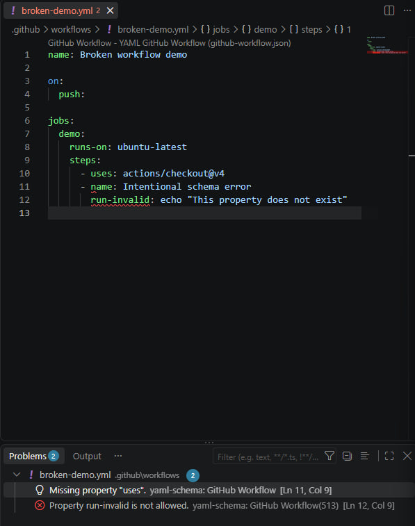

# Лабораторна робота №1 — Середовище та професійний Git workflow

## Мета роботи

Мета лабораторної роботи — підготувати робоче середовище для подальшого вивчення DevOps, налаштувати Git і редактор коду, встановити необхідні інструменти та організувати професійний процес внесення змін через окремі гілки й Pull Request.

## 1. Git і редактор

### 1.1. Глобальні параметри Git

Для налаштування Git я використав такі команди:

```powershell
git config --global user.name "Stanislav Hst"
git config --global user.email "rotarstanislav4@gmail.com"
git config --global init.defaultBranch main
git config --global core.autocrlf true
git config --global pull.rebase true
git config --global core.editor "code --wait"
```

Для перевірки глобальної конфігурації я виконав:

```powershell
git config --list --global
```

Фактичний результат:

```text
credential.helper=manager
safe.directory=D:/forJob/konnen-wizard
safe.directory=D:/forJob/konnen-wizard/.codex-worktrees/k1-ui-correction
core.editor=code --wait
core.autocrlf=true
pull.rebase=true
init.defaultbranch=main
user.email=rotarstanislav4@gmail.com
user.name=Stanislav Hst
```

Параметри `credential.helper` і `safe.directory` існували в моїй глобальній конфігурації раніше та не стосуються цієї лабораторної роботи. Параметри, налаштовані під час виконання лабораторної:

- `user.name=Stanislav Hst`;
- `user.email=rotarstanislav4@gmail.com`;
- `init.defaultbranch=main`;
- `core.autocrlf=true`;
- `pull.rebase=true`;
- `core.editor=code --wait`.

Електронна пошта, указана в `user.email`, підтверджена в моєму GitHub-акаунті. Завдяки цьому GitHub може правильно пов’язувати створені мною коміти з моїм профілем.

Параметр:

```text
init.defaultbranch=main
```

означає, що під час створення нових локальних репозиторіїв Git використовуватиме назву `main` для початкової гілки.

Параметр:

```text
core.editor=code --wait
```

задає Visual Studio Code як редактор для повідомлень комітів та інших операцій Git. Аргумент `--wait` змушує Git чекати, доки файл у VS Code не буде збережений і закритий.

### 1.2. Вибір `core.autocrlf` для Windows

У Windows і Unix-подібних операційних системах використовуються різні символи завершення рядків:

- Windows традиційно використовує `CRLF`;
- Linux і більшість Unix-подібних систем використовують `LF`.

Оскільки лабораторна робота виконується у Windows, я встановив:

```text
core.autocrlf=true
```

За такого налаштування Git може використовувати `CRLF` у робочій копії на Windows, але під час створення коміту нормалізує текстові файли до `LF` у репозиторії.

На Linux і macOS зазвичай доцільніше використовувати:

```text
core.autocrlf=input
```

У цьому режимі Git не змінює `LF` під час отримання файлів із репозиторію, але перетворює випадково додані `CRLF` на `LF` перед створенням коміту.

Якщо команда працює одночасно на Windows і Unix, але не узгодила правила завершення рядків, Git може показувати весь файл як змінений, навіть якщо його зміст фактично не змінювався. Це створює:

- великі й неінформативні `diff`;
- зайві конфлікти під час злиття;
- проблеми із shell-скриптами в Linux;
- проблеми в контейнерах і CI/CD-середовищах;
- складнішу перевірку змін у Pull Request.

Додатково в репозиторії створено файл `.editorconfig`, у якому явно задано:

```ini
end_of_line = lf
```

Це означає, що редактори з підтримкою EditorConfig зберігатимуть файли проєкту з `LF`. Таким чином, `.editorconfig` задає єдиний формат для проєкту, а налаштування Git захищає репозиторій від випадкових відмінностей між операційними системами.

### 1.3. Вибір `pull.rebase=true`

Я встановив:

```text
pull.rebase=true
```

Звичайний `git pull` фактично складається з двох операцій:

1. `git fetch` — отримання нових комітів із віддаленого репозиторію;
2. `git merge` — об’єднання отриманих комітів із локальною гілкою.

Якщо локальна та віддалена гілки одночасно містять нові коміти, стандартна merge-поведінка може створити додатковий merge-коміт.

За налаштування:

```text
pull.rebase=true
```

Git після отримання віддалених змін тимчасово прибирає мої локальні неопубліковані коміти, оновлює гілку, а потім повторно застосовує локальні коміти поверх актуальної історії.

Переваги такого підходу:

- історія залишається лінійною;
- не створюються зайві merge-коміти після звичайного `git pull`;
- `git log` легше читати;
- простіше визначити послідовність змін.

Водночас rebase потрібно використовувати обережно. Не слід без узгодження переписувати коміти, які вже опубліковані та використовуються іншими учасниками команди, оскільки rebase змінює ідентифікатори комітів.

### 1.4. Visual Studio Code

Для роботи з інфраструктурним кодом я використовую Visual Studio Code.

Перевірка версії:

```powershell
code --version
```

Фактичний результат:

```text
1.138.0
7debcd0e2acdea1c52de81bf9ee1620444407dda
x64
```

Установлена версія VS Code:

```text
1.138.0, x64
```

### 1.5. Розширення Visual Studio Code

Для перегляду списку розширень я виконав:

```powershell
code --list-extensions
```

Фактичний результат:

```text
eamodio.gitlens
editorconfig.editorconfig
mike-lischke.vscode-antlr4
ms-azuretools.vscode-containers
ms-azuretools.vscode-docker
redhat.vscode-yaml
yzhang.markdown-all-in-one
```

Для лабораторної роботи встановлені такі розширення:

#### GitLens

```text
eamodio.gitlens
```

GitLens використовується для перегляду історії Git, авторства окремих рядків, інформації про коміти та змін безпосередньо у VS Code.

#### EditorConfig

```text
editorconfig.editorconfig
```

Це розширення забезпечує реальне застосування правил із файлу `.editorconfig` у Visual Studio Code.

#### Containers

```text
ms-azuretools.vscode-containers
```

Розширення додає інструменти для роботи з контейнерами безпосередньо в редакторі.

#### Docker

```text
ms-azuretools.vscode-docker
```

Розширення забезпечує підтримку Dockerfile, Compose-файлів, Docker-контейнерів та образів.

#### YAML

```text
redhat.vscode-yaml
```

Розширення забезпечує підсвічування YAML, перевірку синтаксису та перевірку конфігурацій за відповідними JSON Schema. Зокрема, воно може перевіряти файли GitHub Actions ще до створення коміту.

#### Markdown All in One

```text
yzhang.markdown-all-in-one
```

Розширення полегшує редагування Markdown-файлів і роботу зі структурою документа.

Також у системі було раніше встановлене розширення:

```text
mike-lischke.vscode-antlr4
```

Воно не встановлювалося спеціально для цієї лабораторної роботи й не належить до її обов’язкових компонентів.

### 1.6. Налаштування `.editorconfig`

У корені репозиторію створено файл `.editorconfig`:

```ini
root = true

[*]
charset = utf-8
end_of_line = lf
insert_final_newline = true
indent_style = space
indent_size = 2
trim_trailing_whitespace = true

[*.md]
trim_trailing_whitespace = false

[*.py]
indent_size = 4
```

Значення параметрів:

- `root = true` — цей файл є головним EditorConfig для репозиторію;
- `charset = utf-8` — використовується кодування UTF-8;
- `end_of_line = lf` — використовуються Unix-завершення рядків;
- `insert_final_newline = true` — кожен текстовий файл завершується переносом рядка;
- `indent_style = space` — для відступів використовуються пробіли;
- `indent_size = 2` — стандартний відступ становить два пробіли;
- `trim_trailing_whitespace = true` — зайві пробіли наприкінці рядків видаляються;
- для Markdown видалення кінцевих пробілів вимкнене, оскільки два пробіли можуть використовуватися для явного переносу рядка;
- для Python встановлено стандартний відступ у чотири пробіли.

У Visual Studio Code також увімкнено параметр:

```text
Editor: Format On Save
```

Це дозволяє автоматично форматувати файли під час їх збереження.

### 1.7. Перевірка YAML за схемою GitHub Actions

Для перевірки роботи YAML Schema я тимчасово створив файл:

```text
.github/workflows/broken-demo.yml
```

У ньому було використано навмисно неправильну властивість:

```yaml
run-invalid: echo "This property does not exist"
```

YAML-синтаксис файла залишався правильним, але властивість `run-invalid` не існує в схемі GitHub Actions. Розширення Red Hat YAML виявило цю помилку ще до створення коміту.

Це важливо, тому що перевірка за схемою знаходить не лише неправильні відступи або синтаксичні помилки YAML, а й параметри, яких не підтримує конкретний формат конфігурації.

Результат перевірки:



Після створення скріншота несправний workflow було видалено, щоб він не потрапив у репозиторій і не запускався в GitHub Actions.

Перевірка видалення тестового workflow:

```powershell
Test-Path ".github\workflows\broken-demo.yml"
```

Результат:

```text
False
```

Перевірка наявності скріншота:

```powershell
Test-Path "lab-01\assets\yaml-schema-validation.png"
```

Результат:

```text
True
```

## Висновок до завдання 1

У межах першого завдання я:

- налаштував глобальні параметри Git;
- вибрав `main` як стандартну початкову гілку;
- налаштував обробку завершень рядків для Windows;
- увімкнув rebase-поведінку для `git pull`;
- установив Visual Studio Code і потрібні розширення;
- створив `.editorconfig`;
- увімкнув форматування під час збереження;
- перевірив YAML-файл GitHub Actions за схемою;
- зберіг доказ перевірки в `lab-01/assets/`;
- видалив навмисно несправний workflow після завершення тесту.

Налаштоване середовище забезпечує однакове форматування файлів, читабельну історію Git і раннє виявлення помилок у конфігураційних файлах.

## 2. Середовища виконання

### 2.1. Node.js і менеджер версій `fnm`

Для керування версіями Node.js я використав Fast Node Manager (`fnm`).

`fnm` було встановлено через Windows Package Manager:

```powershell
winget install `
  --id Schniz.fnm `
  --exact `
  --source winget `
  --accept-package-agreements `
  --accept-source-agreements
```

Перевірка версії `fnm`:

```powershell
fnm --version
```

Фактичний результат:

```text
fnm 1.39.0
```

Для автоматичної ініціалізації `fnm` під час запуску PowerShell до файла `$PROFILE` було додано:

```powershell
fnm env --use-on-cd --shell powershell | Out-String | Invoke-Expression
```

Параметр `--use-on-cd` дозволяє `fnm` автоматично перемикати версію Node.js під час переходу до каталогу проєкту, якщо в ньому є файл `.node-version`, `.nvmrc` або відповідне обмеження в `package.json`.

За допомогою `fnm` я встановив дві LTS-гілки Node.js:

```powershell
fnm install 22
fnm install 24
```

Перевірка встановлених версій:

```powershell
fnm list
```

Фактичний результат містить:

```text
v22.23.2
v24.21.0 default
system
```

Версію Node.js 24 установлено як стандартну:

```powershell
fnm default 24
```

Фактична стандартна версія:

```text
v24.21.0
```

#### Перемикання на Node.js 22

Для перемикання на попередню LTS-гілку я виконав:

```powershell
fnm use 22
node --version
npm --version
```

Фактичний результат:

```text
Using Node v22.23.2
v22.23.2
10.9.8
```

#### Перемикання на Node.js 24

Для повернення до актуальної LTS-гілки я виконав:

```powershell
fnm use 24
node --version
npm --version
```

Фактичний результат:

```text
Using Node v24.21.0
v24.21.0
11.19.0
```

Таким чином, на одному комп’ютері встановлено дві версії Node.js, між якими можна перемикатися без перевстановлення Node.js у системі.

Для перевірки походження активного виконуваного файла я виконав:

```powershell
where.exe node
```

Першим було знайдено шлях:

```text
C:\Users\stasi\AppData\Local\fnm_multishells\13856_1790110337396\node.exe
```

Каталог `fnm_multishells` підтверджує, що активна версія Node.js керується саме `fnm`, а не вибирається зі старої системної інсталяції.

### 2.2. Навіщо потрібний менеджер версій Node.js

Різні проєкти можуть мати несумісні вимоги до Node.js. Наприклад, старий проєкт може підтримувати лише Node.js 22, тоді як новий використовує Node.js 24.

Якщо встановлювати Node.js лише глобальним системним інсталятором, перехід між проєктами потребуватиме повторного встановлення Node.js або ручної зміни системного `PATH`.

Менеджер версій розв’язує цю проблему:

- дозволяє одночасно зберігати кілька версій Node.js;
- швидко перемикає активну версію;
- ізолює вимоги різних проєктів;
- дозволяє зафіксувати потрібну версію у файлах проєкту;
- спрощує відтворення однакового середовища учасниками команди та CI/CD;
- не потребує постійного видалення і повторного встановлення Node.js.

Для цієї роботи стандартною версією обрано Node.js 24, оскільки це актуальна LTS-гілка. Node.js 22 залишено для демонстрації роботи з проєктами, що залежать від попередньої LTS-гілки.

### 2.3. Python і менеджер `uv`

Для керування Python я використав `uv`.

`uv` було встановлено через Windows Package Manager:

```powershell
winget install `
  --id astral-sh.uv `
  --exact `
  --source winget `
  --accept-package-agreements `
  --accept-source-agreements
```

Перевірка версії:

```powershell
uv --version
```

Фактичний результат:

```text
uv 0.12.17 (635500036 2026-09-18 x86_64-pc-windows-msvc)
```

Через `uv` я встановив актуальну стабільну гілку Python 3.14:

```powershell
uv python install 3.14
```

Перевірка встановленої версії:

```powershell
uv run --python 3.14 python --version
```

Фактичний результат:

```text
Python 3.14.7
```

Для визначення шляху до керованого інтерпретатора я виконав:

```powershell
uv python find 3.14
```

Фактичний результат:

```text
C:\Users\stasi\AppData\Roaming\uv\python\cpython-3.14-windows-x86_64-none\python.exe
```

Додаткова перевірка через `sys.executable`:

```powershell
uv run --python 3.14 python -c "import sys; print(sys.executable)"
```

Фактичний результат:

```text
C:\Users\stasi\AppData\Roaming\uv\python\cpython-3.14-windows-x86_64-none\python.exe
```

Наявність каталогу `uv` у шляху доводить, що Python 3.14 встановлений і запускається через менеджер `uv`, а не береться з випадкової системної інсталяції.

Основний каталог керованих версій Python:

```powershell
uv python dir
```

Результат:

```text
C:\Users\stasi\AppData\Roaming\uv\python
```

Я обрав Python 3.14.7, тому що це актуальний стабільний реліз. Попередні версії Python можуть залишатися в системі для інших проєктів, але вони не заважають версії, якою керує `uv`.

### 2.4. Навіщо потрібний менеджер версій Python

Різні Python-проєкти можуть залежати від різних версій інтерпретатора та бібліотек.

Використання `uv` забезпечує:

- установлення потрібної версії Python без заміни системного Python;
- вибір конкретної версії для окремого проєкту;
- ізоляцію проєктних середовищ;
- швидке створення virtual environment;
- відтворюваність середовища;
- уникнення конфліктів між залежностями різних проєктів;
- зручне використання Python у локальній розробці та CI/CD.

У цій роботі команда:

```powershell
uv run --python 3.14 python --version
```

явно запускає Python потрібної версії, незалежно від того, які інші версії Python присутні в системному `PATH`.

### 2.5. Docker Desktop

Для контейнеризації я використовую Docker Desktop.

Docker Desktop уже був установлений на комп’ютері до початку лабораторної роботи, тому повторне встановлення не виконувалося. Замість цього я перевірив працездатність Docker Client, Docker Engine і Docker Compose.

Команда перевірки:

```powershell
docker version
```

Основний фактичний результат:

```text
Client:
 Version: 26.0.0
 OS/Arch: windows/amd64

Server: Docker Desktop 4.29.0
 Engine:
  Version: 26.0.0
  OS/Arch: linux/amd64
```

Docker Client запускається у Windows, а Docker Engine у Docker Desktop використовує Linux-середовище для запуску Linux-контейнерів.

Наявність одночасно Client і Server у виводі `docker version` означає, що:

- Docker CLI встановлений;
- Docker Desktop запущений;
- Docker Engine працює;
- клієнт може підключитися до Docker daemon.

### 2.6. Docker Compose v2

Для перевірки Docker Compose я виконав:

```powershell
docker compose version
```

Фактичний результат:

```text
Docker Compose version v2.26.1-desktop.1
```

На комп’ютері використовується Compose v2 як плагін Docker CLI.

Шлях до активного плагіна:

```text
C:\Users\stasi\.docker\cli-plugins\docker-compose.exe
```

У Compose v2 команда записується з пробілом:

```powershell
docker compose
```

Старий окремий Compose v1 використовував команду з дефісом:

```text
docker-compose
```

У цій лабораторній роботі використовується саме Compose v2, як вимагає завдання.

Docker Compose потрібний для декларативного опису багатоконтейнерного застосунку у YAML-файлі. Наприклад, одним Compose-файлом можна описати:

- застосунок;
- базу даних;
- reverse proxy;
- мережі;
- volumes;
- змінні середовища;
- залежності між сервісами.

Після цього всі сервіси можна запускати й зупиняти узгоджено однією командою.

### 2.7. Підсумкова перевірка середовищ

Для фінальної перевірки були використані такі команди:

```powershell
fnm --version
fnm list

fnm use 22
node --version

fnm use 24
node --version

fnm default

uv --version
uv python find 3.14
uv run --python 3.14 python --version

docker version
docker compose version
```

Фактичні встановлені версії:

| Інструмент | Версія |
|---|---:|
| fnm | 1.39.0 |
| Node.js, попередня LTS | 22.23.2 |
| Node.js, актуальна LTS | 24.21.0 |
| npm для Node.js 22 | 10.9.8 |
| npm для Node.js 24 | 11.19.0 |
| uv | 0.12.17 |
| Python | 3.14.7 |
| Docker Desktop | 4.29.0 |
| Docker Engine | 26.0.0 |
| Docker Compose | 2.26.1-desktop.1 |

## Висновок до завдання 2

У межах другого завдання я:

- установив `fnm`;
- налаштував автоматичну ініціалізацію `fnm` у PowerShell;
- установив дві LTS-гілки Node.js;
- продемонстрував перемикання між Node.js 22 і Node.js 24;
- установив Node.js 24 як стандартну версію;
- підтвердив, що Node.js запускається з каталогу `fnm`;
- установив `uv`;
- установив Python 3.14.7 через `uv`;
- підтвердив шлях до керованого Python;
- перевірив Docker Client і Docker Engine;
- перевірив Docker Compose v2;
- пояснив необхідність менеджерів версій для роботи з кількома проєктами.

Налаштоване середовище дозволяє використовувати різні версії Node.js і Python без конфліктів із системними інсталяціями та відповідає вимогам подальших лабораторних робіт.

## 3. GitHub і доступ

### 3.1. Профіль GitHub

Для виконання лабораторної роботи я використовую GitHub-акаунт [StanislavHst](https://github.com/StanislavHst).

Профіль містить:

- ім’я: **Stanislav Rotar**;
- фотографію профілю;
- короткий опис: `DevOps student | Learning Git, Linux, Docker, CI/CD and cloud technologies`.

Ім’я та короткий опис профілю були налаштовані через GitHub CLI:

```powershell
gh api --method PATCH user `
  -f name="Stanislav Rotar" `
  -f bio="DevOps student | Learning Git, Linux, Docker, CI/CD and cloud technologies"
```

Результат перевірено через GitHub API:

```powershell
gh api user --jq '{login: .login, name: .name, bio: .bio}'
```

Результат:

```json
{
  "bio": "DevOps student | Learning Git, Linux, Docker, CI/CD and cloud technologies",
  "login": "StanislavHst",
  "name": "Stanislav Rotar"
}
```

GitHub-профіль є частиною професійного портфоліо. За заповненим профілем викладач, учасник команди або роботодавець може зрозуміти, кому належать репозиторії, чим займається їхній автор і в якому професійному напрямі він розвивається.

### 3.2. Двофакторна автентифікація

Для GitHub-акаунта ввімкнена двофакторна автентифікація.

Стан 2FA перевірено через GitHub API:

```powershell
gh api user --jq .two_factor_authentication
```

Результат:

```text
true
```

Двофакторна автентифікація додає до пароля другий незалежний фактор підтвердження. Якщо пароль стане відомим сторонній особі, самого пароля буде недостатньо для входу в акаунт.

Коди відновлення 2FA не зберігаються в репозиторії та не публікуються у звіті. Їх потрібно зберігати окремо в захищеному місці, наприклад у менеджері паролів.

### 3.3. Створення SSH-ключа

Для автентифікації в GitHub я створив окрему пару SSH-ключів типу `ed25519`.

Команда створення ключа:

```powershell
ssh-keygen -t ed25519 -C "rotarstanislav4@gmail.com"
```

Під час створення ключа була встановлена парольна фраза — `passphrase`. Сама парольна фраза є секретом, тому у звіті не наводиться та ніде не публікується.

Було створено два файли:

```text
C:\Users\stasi\.ssh\id_ed25519
C:\Users\stasi\.ssh\id_ed25519.pub
```

Призначення файлів:

- `id_ed25519` — приватна частина ключа, яка залишається лише на моєму комп’ютері;
- `id_ed25519.pub` — публічна частина ключа, яку можна передавати GitHub та іншим сервісам, до яких потрібно налаштувати доступ.

Тип і fingerprint публічного ключа перевірено командою:

```powershell
ssh-keygen -lf "$env:USERPROFILE\.ssh\id_ed25519.pub"
```

Результат:

```text
256 SHA256:+SGhH4At8whveHHCfEdW6rRt/+Pe/mfqh6G46fZPaIU rotarstanislav4@gmail.com (ED25519)
```

Я вибрав алгоритм `ed25519`, тому що це сучасний алгоритм із короткими ключами, високою криптографічною стійкістю та швидкою роботою. Він прямо вимагається умовою лабораторної роботи й рекомендується GitHub для сучасних операційних систем.

Passphrase додатково захищає приватний ключ. Якщо стороння особа отримає файл приватного ключа, для його використання їй також знадобиться парольна фраза.

### 3.4. Додавання ключа до `ssh-agent`

На комп’ютері використовується Windows OpenSSH Authentication Agent. Стан служби було перевірено командою:

```powershell
Get-Service ssh-agent
```

Приватний ключ додано до агента командою:

```powershell
ssh-add "$env:USERPROFILE\.ssh\id_ed25519"
```

Наявність ключа в агенті перевірено командою:

```powershell
ssh-add -l
```

Для створеного ключа агент показав:

```text
256 SHA256:+SGhH4At8whveHHCfEdW6rRt/+Pe/mfqh6G46fZPaIU rotarstanislav4@gmail.com (ED25519)
```

`ssh-agent` зберігає розблокований ключ у пам’яті поточного користувача. Завдяки цьому не потрібно вводити passphrase перед кожною операцією `git fetch`, `git pull` або `git push`.

### 3.5. Додавання публічного ключа до GitHub

Щоб GitHub CLI отримав дозвіл на керування публічними SSH-ключами, було виконано:

```powershell
gh auth refresh -h github.com -s admin:public_key
```

Після авторизації публічну частину ключа додано до GitHub через консоль:

```powershell
gh ssh-key add "$env:USERPROFILE\.ssh\id_ed25519.pub" `
  --title "Stanislav-Windows-DevOps-2026" `
  --type authentication
```

Ключ було додано як ключ автентифікації з назвою:

```text
Stanislav-Windows-DevOps-2026
```

Назва ключа показує:

- власника ключа;
- пристрій, на якому він використовується;
- призначення ключа;
- рік його створення.

Зрозумілі назви полегшують аудит ключів. Якщо пристрій буде втрачено або скомпрометовано, за назвою можна швидко визначити, який саме ключ потрібно відкликати.

До GitHub додається тільки файл `id_ed25519.pub`. Приватний файл `id_ed25519` нікуди не завантажується.

### 3.6. Перевірка SSH-з’єднання

SSH-з’єднання з GitHub перевірено обов’язковою командою:

```powershell
ssh -T git@github.com
```

Результат:

```text
Hi StanislavHst! You've successfully authenticated, but GitHub does not provide shell access.
```

Цей результат означає, що GitHub розпізнав SSH-ключ та успішно автентифікував користувача `StanislavHst`.

Повідомлення:

```text
GitHub does not provide shell access
```

не є помилкою. GitHub дозволяє використовувати SSH для Git-операцій, але не надає користувачам звичайну командну оболонку на своїх серверах.

Через це команда `ssh -T` може завершитися з кодом `1`, навіть якщо автентифікація відбулася успішно. Основною ознакою успіху є повідомлення:

```text
You've successfully authenticated
```

### 3.7. Використання SSH у репозиторії

Адресу віддаленого репозиторію було змінено з HTTPS на SSH:

```powershell
git remote set-url origin git@github.com:StanislavHst/devops-portfolio.git
```

Налаштовану адресу перевірено командою:

```powershell
git remote -v
```

Результат:

```text
origin  git@github.com:StanislavHst/devops-portfolio.git (fetch)
origin  git@github.com:StanislavHst/devops-portfolio.git (push)
```

SSH було вибрано замість HTTPS, тому що він дозволяє автентифікуватися за допомогою криптографічного ключа без введення логіна, пароля або персонального токена під час кожної Git-операції.

### 3.8. Чому приватний ключ не можна додавати до репозиторію

Приватний SSH-ключ підтверджує особу власника під час автентифікації. Той, хто отримає цей ключ і зможе його розблокувати, потенційно зможе виконувати операції від імені власника.

Приватний ключ не можна додавати до Git-репозиторію з таких причин:

1. Репозиторій можуть клонувати інші користувачі.
2. Файл залишиться в історії Git навіть після його видалення в наступному коміті.
3. Ключ може потрапити у форки, резервні копії, кеші CI/CD та локальні клони.
4. У публічному репозиторії автоматизовані сканери можуть швидко знайти опублікований секрет.
5. Навіть приватний репозиторій не є безпечним сховищем для секретів.
6. Доступ до приватного репозиторію може бути помилково наданий сторонній людині.
7. Додавання файлу до `.gitignore` після коміту не видалить його з попередньої історії Git.

Публічний ключ `id_ed25519.pub` не є секретом. Його призначення — бути переданим GitHub або іншому серверу.

Приватний ключ `id_ed25519` повинен залишатися тільки на пристрої власника. Його не можна:

- додавати до Git;
- надсилати через месенджери;
- публікувати у звіті;
- вставляти в issue або pull request;
- зберігати у відкритому вигляді в хмарному сховищі;
- передавати іншій людині.

### 3.9. Дії у випадку потрапляння приватного ключа в репозиторій

Якщо приватний ключ випадково потрапив у Git-репозиторій, я діятиму в такій послідовності.

#### Крок 1. Вважати ключ скомпрометованим

Не можна покладатися на те, що файл ніхто не встиг побачити або скопіювати. Навіть якщо секрет перебував у репозиторії лише декілька секунд, його потрібно вважати скомпрометованим.

#### Крок 2. Негайно відкликати ключ

У GitHub потрібно відкрити:

```text
Settings → SSH and GPG keys
```

Після цього потрібно знайти скомпрометований ключ і видалити його.

Відкликання ключа потрібно виконати до очищення історії Git. Це одразу припинить можливість використовувати ключ для доступу до GitHub.

#### Крок 3. Видалити ключ з інших систем

Якщо той самий ключ використовувався для доступу до серверів, віртуальних машин або інших сервісів, його публічну частину потрібно видалити з усіх відповідних систем, зокрема з файлів `authorized_keys`.

#### Крок 4. Створити нову пару ключів

Потрібно створити новий приватний та публічний ключі:

```powershell
ssh-keygen -t ed25519 -C "rotarstanislav4@gmail.com"
```

Для нового приватного ключа потрібно встановити нову надійну passphrase.

Старий ключ не можна повторно використовувати навіть після його видалення з репозиторію.

#### Крок 5. Додати новий публічний ключ

Нову публічну частину потрібно додати до GitHub та інших систем, де потрібен SSH-доступ. Після цього потрібно перевірити автентифікацію:

```powershell
ssh -T git@github.com
```

#### Крок 6. Видалити старий ключ із `ssh-agent`

Скомпрометований ключ потрібно прибрати з SSH-агента. Після цього до агента потрібно додати новий ключ.

#### Крок 7. Очистити всю історію Git

Простого видалення файлу новим комітом недостатньо, тому що приватний ключ залишиться в попередніх комітах.

Для повного видалення секрету з історії можна використати:

- `git filter-repo`;
- BFG Repo-Cleaner.

Очищення повинно охоплювати всі гілки й теги, у яких міг бути приватний ключ.

#### Крок 8. Опублікувати очищену історію

Після переписування історії знадобиться узгоджений force-push.

У командному репозиторії перед цим потрібно повідомити всіх учасників. Після переписування історії їм може знадобитися повторно клонувати репозиторій, щоб не повернути стару історію назад.

#### Крок 9. Перевірити інші копії

Потрібно перевірити:

- форки;
- pull request;
- локальні клони інших учасників;
- кеші CI/CD;
- артефакти збірок;
- журнали команд;
- резервні копії.

Переписування історії основного репозиторію не гарантує автоматичного видалення секрету з усіх копій.

#### Крок 10. Перевірити журнал безпеки GitHub

Необхідно переглянути журнал безпеки акаунта та перевірити:

- невідомі входи;
- підозрілі Git-операції;
- невідомі SSH-ключі;
- нові токени;
- сторонні авторизовані застосунки;
- активні сесії;
- неочікувані зміни в репозиторіях.

Якщо виявлено підозрілу активність, потрібно також змінити пароль GitHub, відкликати невідомі токени та завершити сторонні сесії.

#### Крок 11. Повідомити команду або адміністратора

Якщо репозиторій є спільним, потрібно повідомити інших учасників про інцидент, відкликання ключа та можливе переписування історії.

#### Крок 12. Запобігти повторенню інциденту

Після усунення інциденту потрібно:

- перевірити правила `.gitignore`;
- не копіювати каталог `.ssh` у робочі каталоги проєктів;
- перед комітом перевіряти `git status`;
- використовувати засоби пошуку секретів;
- зберігати секрети в менеджерах секретів;
- перевірити права доступу до каталогу `.ssh`;
- ніколи не публікувати приватні ключі у звітах або повідомленнях.

Найважливіше правило: спочатку потрібно відкликати скомпрометований ключ, а вже потім очищати історію. Видалення файлу з репозиторію не робить уже опублікований ключ знову безпечним.

### 3.10. Висновок до завдання 3

У межах завдання було:

- заповнено GitHub-профіль;
- додано фотографію та короткий професійний опис;
- перевірено ввімкнення двофакторної автентифікації;
- створено SSH-ключ типу `ed25519`;
- встановлено passphrase для приватного ключа;
- ключ додано до `ssh-agent`;
- публічну частину додано до GitHub через консоль;
- успішно перевірено SSH-автентифікацію;
- адресу віддаленого репозиторію змінено з HTTPS на SSH;
- визначено послідовність реагування на можливу компрометацію приватного ключа.

У результаті GitHub-акаунт має додатковий захист через 2FA, а Git-операції виконуються через SSH із використанням захищеного парольною фразою ключа.

## 4. Портфоліо-репозиторій

### 4.1. Створення репозиторію

Для лабораторних робіт створено окремий репозиторій:

```text
https://github.com/StanislavHst/devops-portfolio
```

Назва `devops-portfolio` показує, що репозиторій використовується як портфоліо з практичними роботами за напрямом DevOps.

Віддалений репозиторій підключено через SSH:

```powershell
git remote -v
```

Результат:

```text
origin  git@github.com:StanislavHst/devops-portfolio.git (fetch)
origin  git@github.com:StanislavHst/devops-portfolio.git (push)
```

### 4.2. Публічна видимість репозиторію

За умовою лабораторної роботи репозиторій повинен бути публічним. Видимість змінено через GitHub CLI:

```powershell
gh repo edit StanislavHst/devops-portfolio `
  --visibility public `
  --accept-visibility-change-consequences
```

Результат перевірено командою:

```powershell
gh repo view StanislavHst/devops-portfolio `
  --json nameWithOwner,visibility,url
```

Результат:

```json
{
  "nameWithOwner": "StanislavHst/devops-portfolio",
  "url": "https://github.com/StanislavHst/devops-portfolio",
  "visibility": "PUBLIC"
}
```

Публічна видимість потрібна для використання репозиторію як портфоліо. Вона також дозволяє викладачеві переглянути результат роботи та потрібна для роботи правил захисту гілок у персональному репозиторії на безкоштовному плані GitHub.

Оскільки репозиторій публічний, перед кожним комітом потрібно перевіряти, що до нього не потрапили паролі, токени, приватні SSH-ключі, файли `.env` або інші секретні дані.

### 4.3. Головний README портфоліо

У корені репозиторію створено файл `README.md`, який є головною сторінкою портфоліо.

README містить:

- коротке представлення;
- опис професійної мети;
- перелік технологій, з якими я вже працюю;
- перелік технологій, які планую вивчити;
- план професійного розвитку на рік;
- таблицю лабораторних робіт;
- структуру репозиторію;
- контактні дані;
- посилання на GitHub-профіль;
- інформацію про ліцензію.

README написано для стороннього читача. Він дозволяє швидко зрозуміти призначення репозиторію, поточні навички автора та напрям подальшого розвитку.

### 4.4. Генерація `.gitignore`

Файл `.gitignore` не був написаний повністю вручну. Його згенеровано за допомогою сервісу Toptal Gitignore:

```text
https://www.toptal.com/developers/gitignore
```

Для генерації вибрано шаблони:

- `Windows`;
- `VisualStudioCode`;
- `Node`;
- `Python`.

Команда генерації:

```powershell
Invoke-WebRequest `
  -Uri "https://www.toptal.com/developers/gitignore/api/windows,visualstudiocode,node,python" `
  -OutFile ".gitignore"
```

Початок створеного файла:

```text
# Created by https://www.toptal.com/developers/gitignore/api/windows,visualstudiocode,node,python
# Edit at https://www.toptal.com/developers/gitignore?templates=windows,visualstudiocode,node,python
```

Шаблон `Windows` потрібний для виключення службових файлів операційної системи. `VisualStudioCode` виключає локальні налаштування редактора, які не повинні бути спільними для всіх користувачів. `Node` виключає залежності `node_modules`, кеші та журнали. `Python` виключає `__pycache__`, віртуальні середовища, кеші та результати роботи Python-інструментів.

Згенерований `.gitignore` зменшує ризик випадкового додавання залежностей, кешів, локальних налаштувань і тимчасових файлів до репозиторію.

### 4.5. Вибір ліцензії

Для репозиторію вибрано **MIT License**.

Офіційний текст ліцензії отримано через GitHub API:

```powershell
$licenseBody = gh api licenses/mit --jq ".body"
$licenseBody = $licenseBody.Replace("[year]", "2026")
$licenseBody = $licenseBody.Replace("[fullname]", "Stanislav Rotar")

Set-Content `
  -LiteralPath "LICENSE" `
  -Value $licenseBody `
  -Encoding utf8
```

Початок файла:

```text
MIT License

Copyright (c) 2026 Stanislav Rotar
```

**MIT License обрана тому, що вона дозволяє іншим людям переглядати, використовувати, копіювати та змінювати матеріали навчального портфоліо за умови збереження повідомлення про авторські права.**

Ця ліцензія є простою та добре підходить для відкритого навчального репозиторію. Вона також містить застереження про відсутність гарантій з боку автора.

Альтернативою могла бути GPL, але вона вимагає, щоб похідні роботи також поширювалися під сумісною copyleft-ліцензією. Для навчального портфоліо така вимога була б зайвою. Apache License 2.0 містить детальніші положення про патентні права, але для цього репозиторію MIT є простішим і достатнім варіантом.

### 4.6. Структура каталогів

Для кожної лабораторної роботи створено окремий каталог. Також створено каталог для фінального проєкту.

Структуру створено через PowerShell:

```powershell
2..10 | ForEach-Object {
    $directory = "lab-{0:D2}" -f $_
    New-Item -ItemType Directory -Path $directory -Force | Out-Null
    New-Item -ItemType File -Path "$directory\.gitkeep" -Force | Out-Null
}

New-Item -ItemType Directory -Path "final" -Force | Out-Null
New-Item -ItemType File -Path "final\.gitkeep" -Force | Out-Null
```

Підсумкова структура:

```text
devops-portfolio/
├── .github/
├── final/
│   └── .gitkeep
├── lab-01/
│   ├── assets/
│   │   └── yaml-schema-validation.png
│   └── README.md
├── lab-02/
│   └── .gitkeep
├── lab-03/
│   └── .gitkeep
├── lab-04/
│   └── .gitkeep
├── lab-05/
│   └── .gitkeep
├── lab-06/
│   └── .gitkeep
├── lab-07/
│   └── .gitkeep
├── lab-08/
│   └── .gitkeep
├── lab-09/
│   └── .gitkeep
├── lab-10/
│   └── .gitkeep
├── .editorconfig
├── .gitignore
├── LICENSE
└── README.md
```

Файли `.gitkeep` потрібні тому, що Git не відстежує порожні каталоги. Після появи реальних файлів лабораторної роботи відповідний `.gitkeep` можна буде видалити.

Заздалегідь створена структура робить організацію репозиторію передбачуваною: кожна наступна робота матиме визначене місце, а фінальний проєкт буде відокремлений від лабораторних.

### 4.7. Перевірка відсутності секретів

Оскільки репозиторій став публічним, перед додаванням файлів було перевірено, що серед змін немає приватних SSH-ключів:

```powershell
git status --short |
  Select-String -Pattern "id_rsa|id_ed25519|\.pem|\.key"
```

Команда нічого не вивела, тобто приватні ключі не потрапили до робочого дерева репозиторію.

Файли SSH зберігаються окремо:

```text
C:\Users\stasi\.ssh
```

Цей каталог не розташований усередині репозиторію.

### 4.8. Висновок до завдання 4

У межах завдання створено публічний репозиторій `devops-portfolio`, підготовлено головну сторінку портфоліо, згенеровано `.gitignore`, свідомо обрано MIT License та створено структуру каталогів для всіх лабораторних робіт і фінального проєкту.

У результаті репозиторій має зрозумілу структуру, містить основну інформацію про мій професійний розвиток і готовий до додавання наступних робіт курсу.

## 5. Правила репозиторію

### 5.1. Налаштування способу злиття

Для репозиторію залишено один основний спосіб злиття pull request:

```text
Squash and merge
```

Поточні налаштування репозиторію:

```json
{
  "mergeCommitAllowed": false,
  "rebaseMergeAllowed": false,
  "squashMergeAllowed": true
}
```

Squash merge об’єднує всі коміти робочої гілки в один підсумковий коміт у `main`. Це дозволяє зберегти лінійну та читабельну історію основної гілки.

Звичайний merge commit вимкнений, оскільки він створював би додаткові розгалуження в історії та конфліктував би з вимогою лінійної історії.

### 5.2. Ruleset для гілки `main`

Для захисту основної гілки створено ruleset:

```text
Protect main
```

Його ідентифікатор:

```text
23863507
```

Ruleset має стан:

```text
Active
```

Він застосовується до default branch, тобто до `main`.

Перевірку виконано через GitHub API:

```powershell
gh api repos/StanislavHst/devops-portfolio/rulesets `
  --jq '.[] | {id: .id, name: .name, target: .target, enforcement: .enforcement}'
```

Результат:

```json
{
  "enforcement": "active",
  "id": 23863507,
  "name": "Protect main",
  "target": "branch"
}
```

Повну конфігурацію перевірено командою:

```powershell
gh api repos/StanislavHst/devops-portfolio/rulesets/23863507
```

Ruleset містить такі правила:

```text
deletion
non_fast_forward
required_linear_history
pull_request
```

### 5.3. Обов’язковий pull request

Для `main` увімкнено правило:

```text
Require a pull request before merging
```

Будь-яка зміна основної гілки повинна пройти через окрему робочу гілку та pull request.

Це забезпечує:

- видимий опис запропонованих змін;
- можливість переглянути diff до злиття;
- місце для обговорення;
- зв’язок змін із відповідною issue;
- контрольований процес злиття;
- зрозумілу історію прийнятих рішень.

Кількість обов’язкових схвалень установлена в `0`, тому що репозиторій персональний. Автор pull request не може схвалити власний PR, а іншого учасника в репозиторії поки немає.

Незважаючи на відсутність обов’язкового схвалення, зміни все одно повинні бути внесені через PR.

### 5.4. Заборона force-push

У ruleset увімкнено:

```text
Block force pushes
```

У GitHub API це правило має тип:

```text
non_fast_forward
```

Force-push дозволяє переписати історію віддаленої гілки. Для `main` це небезпечно, тому що коміти можуть зникнути, а гілки інших учасників можуть почати посилатися на історію, якої більше немає.

Заборона force-push захищає основну гілку від випадкового або навмисного переписування історії.

### 5.5. Заборона видалення `main`

Увімкнено правило:

```text
Restrict deletions
```

У GitHub API воно має тип:

```text
deletion
```

Це правило захищає основну гілку від випадкового видалення.

Видалення робочих гілок після merge є нормальним, але default branch `main` повинна залишатися постійною точкою інтеграції змін.

### 5.6. Лінійна історія

Увімкнено правило:

```text
Require linear history
```

У GitHub API воно має тип:

```text
required_linear_history
```

Лінійна історія не допускає merge-коміти в `main`. Для злиття використовується `Squash and merge`, тому кожен pull request додає до основної гілки один підсумковий коміт.

Переваги лінійної історії:

- простіший `git log`;
- легше знайти зміну, яка спричинила помилку;
- простіше виконувати `git bisect`;
- легше скасовувати окремі зміни;
- історія не містить зайвих merge-комітів.

### 5.7. Правила, які поки не ввімкнені

#### Обов’язкові status checks

Required status checks поки не ввімкнені, оскільки в репозиторії ще немає налаштованого CI/CD-конвеєра.

GitHub формує список доступних перевірок із jobs, які вже хоча б один раз запускалися. До створення GitHub Actions workflow немає коректного імені перевірки, яке можна зробити обов’язковим.

Status checks будуть додані після створення CI-конвеєра в наступних лабораторних роботах.

#### Обов’язкова рецензія

Required approvals установлено в `0`.

У персональному репозиторії вимога хоча б одного approval заблокувала б злиття: автор pull request не може схвалити власний PR, а іншого учасника немає.

Після появи команди кількість обов’язкових схвалень потрібно збільшити щонайменше до одного.

#### Повна заборона обходу правил

Для ролі адміністратора залишено bypass:

```text
Repository admin → Always allow
```

У персональному репозиторії повна заборона обходу може бути шкідливою. Якщо конфігурація ruleset помилкова, немає іншого адміністратора, який міг би допомогти виправити ситуацію.

Наявність bypass не означає, що його потрібно використовувати під час звичайної роботи. Лабораторна все одно виконується через pull request.

### 5.8. Зміни під час командної роботи

Коли репозиторій стане командним, налаштування потрібно зробити суворішими.

Потрібно буде:

1. Установити щонайменше один обов’язковий approval.
2. Для критичних змін можна вимагати два approvals.
3. Додати файл `CODEOWNERS` для автоматичного призначення відповідальних за окремі частини проєкту.
4. Увімкнути скидання старих approvals після додавання нових комітів.
5. Вимагати схвалення останнього набору змін іншою людиною.
6. Увімкнути обов’язкове вирішення всіх review conversations.
7. Додати обов’язкові CI status checks.
8. Вимагати успішне тестування, lint і перевірку безпеки.
9. Обмежити або повністю заборонити адміністративний bypass.
10. За потреби дозволити bypass лише спеціальному технічному GitHub App.

У команді заборона адміністративного обходу є безпечнішою, тому що є декілька учасників та адміністраторів. Якщо один користувач не може виконати дію, інший учасник може переглянути зміни, схвалити PR або допомогти виправити конфігурацію.

У персональному репозиторії така заборона шкідлива, тому що власник є єдиним автором, рецензентом і адміністратором. Надто суворе правило може створити ситуацію, у якій немає іншої людини, здатної розблокувати роботу.

### 5.9. GitHub Project

Для планування робіт створено публічний GitHub Project:

```text
DevOps Course 2026
```

Номер Project:

```text
6
```

Посилання:

```text
https://github.com/users/StanislavHst/projects/6
```

Project містить чотири статуси:

```text
Backlog
In Progress
Review
Done
```

Їхнє призначення:

- `Backlog` — роботу заплановано, але ще не розпочато;
- `In Progress` — робота виконується;
- `Review` — зміни завершені та передані на перевірку через PR;
- `Done` — роботу завершено й відповідні зміни злито.

### 5.10. Задачі курсу

У репозиторії створено 11 issue:

- `Лабораторна робота 01`;
- `Лабораторна робота 02`;
- `Лабораторна робота 03`;
- `Лабораторна робота 04`;
- `Лабораторна робота 05`;
- `Лабораторна робота 06`;
- `Лабораторна робота 07`;
- `Лабораторна робота 08`;
- `Лабораторна робота 09`;
- `Лабораторна робота 10`;
- `Фінальний DevOps-проєкт`.

Issue створено через GitHub CLI:

```powershell
1..10 | ForEach-Object {
    $number = "{0:D2}" -f $_

    gh issue create `
      --repo StanislavHst/devops-portfolio `
      --title "Лабораторна робота $number" `
      --body "Виконати, задокументувати та здати лабораторну роботу $number через pull request."
}
```

Задачу фінального проєкту створено командою:

```powershell
gh issue create `
  --repo StanislavHst/devops-portfolio `
  --title "Фінальний DevOps-проєкт" `
  --body "Спроєктувати, реалізувати, задокументувати та захистити фінальний DevOps-проєкт."
```

Автоматизація успішно додала всі 11 issue до Project зі статусом `Backlog`.

Після початку виконання `Лабораторна робота 01` була вручну переміщена:

```text
Backlog → In Progress
```

Перехід у `In Progress` виконується вручну, оскільки GitHub не може автоматично визначити момент фактичного початку роботи.

### 5.11. Автоматизації Project

#### Автоматичне додавання items

Увімкнено workflow:

```text
Auto-add to project
```

Налаштування:

```text
Repository: StanislavHst/devops-portfolio
Filter: is:issue,pr is:open
```

Він додає до Project нові відкриті issue та pull request.

#### Нова задача → Backlog

Увімкнено:

```text
Item added to project
Type: issue
Set: Status → Backlog
```

Кожна нова issue автоматично потрапляє до `Backlog`.

#### Пов’язаний pull request → Review

Увімкнено:

```text
Pull request linked to issue
Set: Status → Review
```

Pull request зв’язується з issue за допомогою closing keyword:

```text
Closes #номер
```

Коли PR пов’язується з issue, відповідна задача автоматично переходить із `In Progress` у `Review`.

В актуальному інтерфейсі GitHub Projects ця подія використовується як реалізація переходу «відкритий PR → Review».

#### Злитий pull request → Done

Увімкнено:

```text
Pull request merged
Set: Status → Done
```

Після успішного злиття PR його картка отримує статус `Done`.

#### Закрита задача → Done

Увімкнено:

```text
Item closed
Type: issue, pull request
Set: Status → Done
```

Якщо PR містить `Closes #номер`, після merge GitHub автоматично закриває пов’язану issue. Workflow переводить закриту задачу з `Review` у `Done`.

Підсумковий життєвий цикл задачі:

```text
Backlog → In Progress → Review → Done
```

### 5.12. Вимкнені зайві автоматизації

Workflow `Auto-add sub-issues to project` вимкнено, оскільки в цій лабораторній не використовується ієрархія підзадач.

Workflow `Auto-close issue` також вимкнено. У межах обраного процесу issue закривається після merge через closing keyword, а вже факт закриття переводить її у `Done`.

Інші непотрібні workflows також не використовуються.

### 5.13. Шаблон pull request

Створено файл:

```text
.github/pull_request_template.md
```

Шаблон містить:

- опис змін;
- посилання на пов’язану issue;
- тип змін;
- спосіб перевірки;
- чекліст самоперевірки;
- перевірку відсутності секретів;
- перевірку документації.

Для автоматичного закриття задачі використовується конструкція:

```text
Closes #номер
```

Шаблон стандартизує pull request і зменшує ризик пропустити важливу інформацію перед злиттям.

### 5.14. Висновок до завдання 5

Для гілки `main` налаштовано активний ruleset, який вимагає pull request, забороняє force-push і видалення гілки та забезпечує лінійну історію.

Створено публічний GitHub Project із задачами на всі лабораторні роботи та фінальний проєкт. Налаштовано життєвий цикл `Backlog → In Progress → Review → Done` і відповідні автоматизації.

Також створено шаблон pull request із описом змін, посиланням на задачу, способом перевірки та чеклістом самоперевірки.
